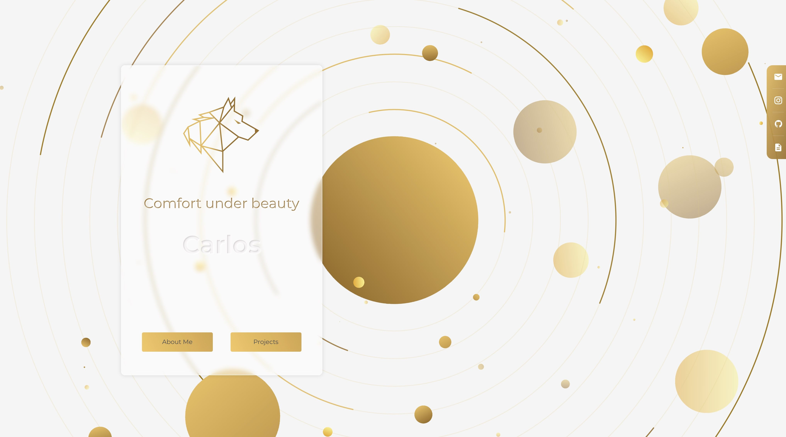

<!-- Title & Logo -->
<h1 align="center">Carlos WebResume v2</h1>

<!-- tag & links (Version\Lang\Package) -->

    
    
    
    
    
    

	Demo：<a href="https://evilz0212.github.io/carlos-webresume-v2/">Git Pages</a>
    <!-- ｜ 
	Design：<a href="">Figma</a> -->

<!-- Overview (Preview\Purpose\Description) -->

# Overview
> 互動特效履歷（作品集）

### Target
1. UI 設計
   - Wireframe 文案\排版
   - Mockup 玻璃擬真風格設計
   - 互動特效設計
2. Vue 前端專案建構
   - scss 樣式組件化
   - p5.js 互動特效動畫繪圖
   - git pages 編譯設定

### Detail
-  前端框架：Vue(3.0), Vuex, Vue-Router
-  編譯工具：Vite
-  模板語言：ES6, SASS, Pug
-  應用套件：p5.js

<!-- Partner -->

<!-- License -->